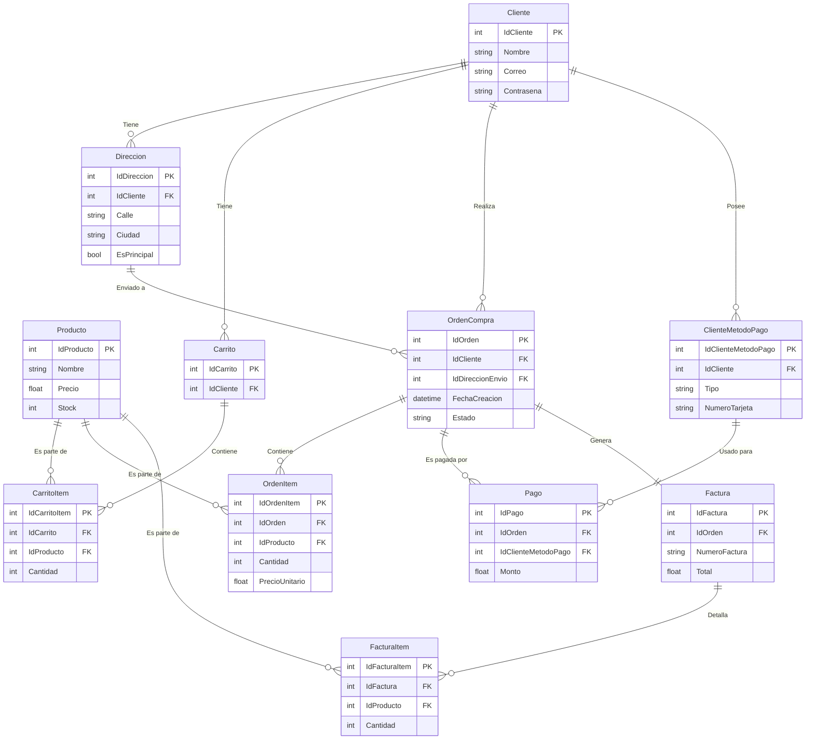

# Documentación del Proyecto Ecommerce

## 1. Introducción

Este proyecto es una aplicación web completa de comercio electrónico con fines educativos. Implementa funcionalidades modernas como carrito de compras, registro de clientes, gestión de órdenes y pagos. La solución está construida con un frontend tipo SPA (Single Page Application) usando HTML y JavaScript puro (vanilla), un backend RESTful con ASP.NET Core Web API, y una base de datos SQLite.

## 2. Arquitectura del Sistema

El sistema sigue una arquitectura de N-Capas clásica, separando claramente las responsabilidades para facilitar el mantenimiento y la escalabilidad.

```mermaid
graph TD;
    subgraph "Cliente"
        User[👤 Usuario]
    end

    subgraph "Frontend (Navegador)"
        SPA[🌐 Aplicación SPA<br>(HTML, JS, CSS)]
    end

    subgraph "Backend (Servidor)"
        API[🚀 API REST<br>(ASP.NET Core)]
        BLL[🧩 Lógica de Negocio<br>(Servicios)]
        DAL[📦 Acceso a Datos<br>(Entity Framework)]
    end

    subgraph "Base de Datos"
        DB[🗄️ Base de Datos<br>(SQLite)]
    end

    User --> SPA;
    SPA -- Peticiones HTTP<br>(fetch + JWT) --> API;
    API --> BLL;
    BLL --> DAL;
    DAL --> DB;
```

## 3. Base de Datos

### 3.1. Descripción de Entidades

La base de datos está diseñada para soportar un flujo de comercio electrónico estándar. Las entidades principales son:

-   **Cliente**: Almacena la información de los usuarios registrados, incluyendo credenciales y datos personales.
-   **Producto**: Contiene todos los artículos disponibles para la venta, con su nombre, precio, stock, etc.
-   **Direccion**: Guarda las direcciones de envío asociadas a cada cliente.
-   **Carrito** y **CarritoItem**: Representan el carrito de compras temporal de un cliente antes de finalizar la compra. Se vincula directamente con el cliente y los productos.
-   **OrdenCompra** y **OrdenItem**: Almacenan los detalles de un pedido confirmado. Es un registro histórico de las compras.
-   **ClienteMetodoPago**: Asocia uno o más métodos de pago (ej. datos de una tarjeta) a un cliente específico.
-   **Pago**: Registra la transacción económica vinculada a una `OrdenCompra` y un `ClienteMetodoPago`.
-   **Factura** y **FacturaItem**: Contienen la información de la factura oficial generada a partir de una `OrdenCompra`.

### 3.2. Diagrama Entidad-Relación (ERD)

El siguiente diagrama ilustra las relaciones entre las tablas principales de la base de datos.



## 4. API Backend (RESTful)

### 4.1. Autenticación (JWT)

La API utiliza JSON Web Tokens (JWT) para gestionar la autenticación y proteger los endpoints. El flujo es el siguiente:

1.  **Registro/Login**: El cliente envía las credenciales de usuario (`nombre`, `correo`, `contraseña`) al endpoint correspondiente.
2.  **Generación de Token**: Si las credenciales son válidas, el servidor genera un token JWT que contiene información del usuario (ID, correo, nombre) y lo devuelve al cliente.
3.  **Peticiones Autenticadas**: Para acceder a rutas protegidas, el cliente debe incluir el token JWT en la cabecera `Authorization` de cada petición HTTP.

> **Nota importante**: En esta versión de demostración, las contraseñas se almacenan y comparan en **texto plano**. Esto no es una práctica segura para producción.

### 4.2. Endpoints Principales

A continuación se listan algunos de los endpoints más relevantes de la API:

| Método | Ruta                                      | Descripción                                            | Requiere Auth |
| :----- | :---------------------------------------- | :----------------------------------------------------- | :------------ |
| `POST` | `/api/auth/register`                      | Registra un nuevo cliente.                             | No            |
| `POST` | `/api/auth/login`                         | Inicia sesión y devuelve un token JWT.                 | No            |
| `GET`  | `/api/productos`                          | Obtiene la lista de productos (con filtros opcionales).| No            |
| `GET`  | `/api/productos/{id}`                     | Obtiene los detalles de un producto específico.        | No            |
| `GET`  | `/api/clientes/{id}/direcciones`          | Obtiene las direcciones de un cliente.                 | Sí            |
| `POST` | `/api/clientes/{id}/direcciones`          | Añade una nueva dirección para un cliente.             | Sí            |
| `GET`  | `/api/clientes/{id}/metodos-pago`         | Obtiene los métodos de pago de un cliente.             | Sí            |
| `POST` | `/api/checkout/finalizar`                 | Procesa el carrito para crear una Orden y una Factura. | Sí            |
| `GET`  | `/api/orders/cliente/{id}`                | Obtiene el historial de órdenes de un cliente.         | Sí            |

## 5. Aplicación Frontend (SPA)

El frontend es una Single-Page Application (SPA) desarrollada sin frameworks, utilizando únicamente HTML, CSS y JavaScript (vanilla). Todos los archivos se encuentran en el directorio `EcommerceWebAPI/wwwroot/`.

### 5.1. Estructura de Archivos

La estructura del frontend está organizada por funcionalidad:

-   **Páginas HTML**:
    -   `index.html`: Página principal que muestra el catálogo de productos.
    -   `login.html` / `registrarse.html`: Formularios de autenticación.
    -   `checkout.html`: Página para finalizar la compra.
    -   `orders.html`: Historial de pedidos del cliente.
    -   `mi_perfil.html`: Edición de los datos del perfil del cliente.
    -   `direcciones.html`: Gestión de las direcciones de envío.
    -   `metodo_pago.html`: Gestión de los métodos de pago.
-   **Scripts JavaScript (`/js`)**:
    -   Cada página HTML principal tiene su propio archivo JS para manejar su lógica específica (ej. `login.js`, `registrarse.js`).
    -   `index.js`: Contiene la lógica principal de la aplicación, como la carga de productos y la gestión del carrito.
    -   Se utilizan módulos para separar responsabilidades (ej. `checkout/`, `direcciones/`).

### 5.2. Comunicación Cliente-Servidor

La comunicación con el backend se realiza de forma asíncrona mediante la API `fetch` del navegador.

-   **Almacenamiento de Sesión**: Tras un inicio de sesión exitoso, el `token` JWT y el `clienteId` recibidos del servidor se guardan en el `localStorage` del navegador.
-   **Peticiones Autenticadas**: Para realizar llamadas a endpoints protegidos, el script recupera el token del `localStorage` y lo adjunta en la cabecera `Authorization` de la petición HTTP. Esto permite al backend verificar la identidad del usuario.

## 6. Cómo Ejecutar el Proyecto

Para levantar el proyecto en un entorno local, sigue estos pasos:

1.  **Requisitos Previos**:
    -   Tener instalado el **SDK de .NET 8** o una versión superior.

2.  **Clonar el Repositorio**:
    ```sh
    git clone <URL_DEL_REPOSITORIO>
    cd <NOMBRE_DEL_DIRECTORIO>
    ```

3.  **Ejecutar el Backend**:
    -   Abre una terminal en la raíz del proyecto.
    -   Ejecuta el siguiente comando para iniciar el servidor de la API:
    ```sh
    dotnet run --project EcommerceWebAPI/EcommerceWebAPI.csproj
    ```

4.  **Acceder a la Aplicación**:
    -   Una vez que el servidor esté en funcionamiento, la consola mostrará las URLs locales donde la aplicación está escuchando (ej. `http://localhost:5194`).
    -   Abre tu navegador web y navega a esa dirección para ver la tienda online.
